# Context-aware 구현 명세 (최종)

## 목차

- [0. 목표와 범위](#sec-0)
- [1. 전체 파이프라인(개요)](#sec-1)
- [2. 데이터 소스 및 조인 키](#sec-2)
  - [2.1 Steam API / Store / Review](#sec-2-1)
  - [2.2 외부 소스(선택)](#sec-2-2)
- [3. 출력 스키마(권장)](#sec-3)
- [4. 컨텍스트 모듈 상세](#sec-4)
  - [4.1 상황/시간(Situational)](#sec-4-1)
  - [4.2 플레이 스타일(Play Style)](#sec-4-2)
  - [4.3 최근 행동/활성도(Behavior/Activity)](#sec-4-3)
  - [4.4 심리/감성(Sentiment/Persona)](#sec-4-4)
  - [4.5 콘텐츠/캐릭터(Content/Character)](#sec-4-5)
  - [4.6 서사/캐릭터 톤(Narrative Tone)](#sec-4-6)
  - [4.7 완성도/신뢰도(Quality/Trust)](#sec-4-7)
  - [4.8 라이브 상태(Live)](#sec-4-8)
  - [4.9 할인(Discount)](#sec-4-9)
- [5. 구현 우선순위(권장)](#sec-5)
- [6. 개발 체크리스트](#sec-6)

---

## 0. 목표와 범위

- **목표**: “과거 취향”보다 **지금 이 순간의 상태/의도/제약**을 반영해 추천 후보를 만들고, 이후 필터링/Top-K 의사결정으로 넘길 **컨텍스트 벡터(=feature bundle)** 를 생성한다.
- **범위**: 컨텍스트 생성(유저/게임 단위 피처) + 후보 확장에 쓰일 신호까지 포함  
  (최종 랭킹/필터링은 `docs/workflow.md`의 Phase 3~4에서 수행)

---

## 1. 전체 파이프라인 (개요)

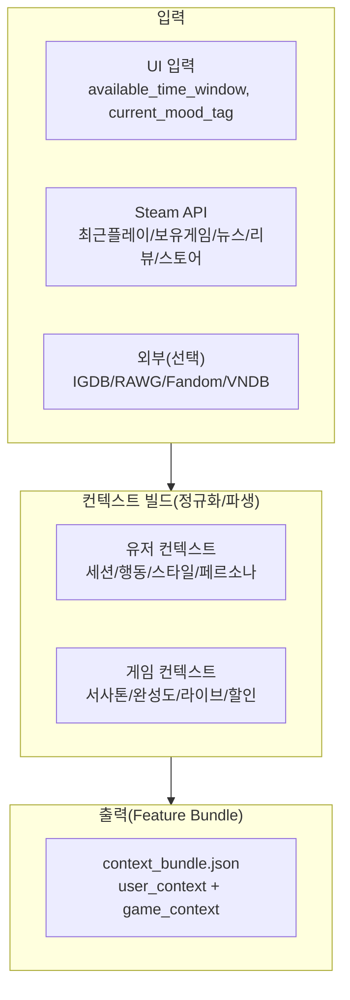

---

## 2. 데이터 소스 및 조인 키

### 2.1 Steam API / Store / Review

- **유저/플레이**: `IPlayerService.GetOwnedGames`, `GetRecentlyPlayedGames`
  - 조인 키: `games[].appid`
- **게임 메타/설명**: Steam Store API ` /api/appdetails `
  - 조인 키: `appid`
- **도전과제 스키마**: `ISteamUserStats.GetSchemaForGame`
  - 조인 키: `appid`
- **뉴스/라이브**: `ISteamNews.GetNewsForApp`
  - 조인 키: `appid`
- **리뷰(품질 신호)**: ` /appreviews `
  - 조인 키: `appid`

### 2.2 외부 소스 (선택)

PDF에 포함된 아래 소스는 **MVP에서 “선택 기능”** 으로 분리하는 것을 권장합니다(키 매핑/정합성 비용 큼).

- IGDB / RAWG / Fandom / VNDB: 캐릭터/세계관/테마 확장

---

## 3. 출력 스키마(권장)

개발 시에는 “모듈별 산출물”을 하나로 합친 `context_bundle`을 표준으로 둡니다.

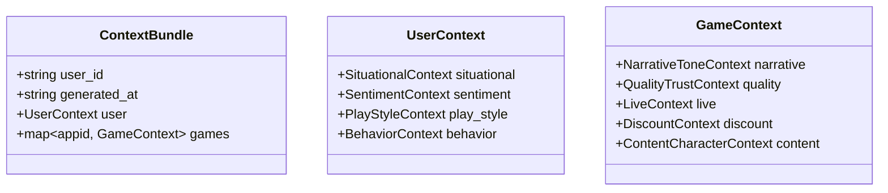

> **주의**: Mermaid 파싱 에러 방지를 위해 라벨에 괄호/슬래시가 들어가면 항상 `["..."]`로 감싸세요.

---

## 4. 컨텍스트 모듈 상세 (중복 제거한 “최종” 정의)

아래 모듈은 PDF의 1~8을 **기능 기준으로 재정렬**했습니다.

### 4.1 상황/시간 컨텍스트 (Situational)

**목적**: 유저의 현재 여유 시간 + 플레이 습관 + 현재 시점(주말/시간대)을 반영해 “세션 적합 게임”으로 후보를 좁힌다.

| 항목 | 출처 | 필드 | 가공/역할 |
|---|---|---|---|
| 시간 제약 | UI | `available_time_window` | 30분/1시간/2시간+ 등으로 세션 길이 필터 |
| 플레이 습관 | Steam (`GetRecentlyPlayedGames`) | `average_session_duration` | 유저 평균 세션 길이 추정 |
| 현재 시점 | 시스템 시간 | `is_weekend`, `time_of_day` | 야간/주말 가중치(몰입/감성) 등 |

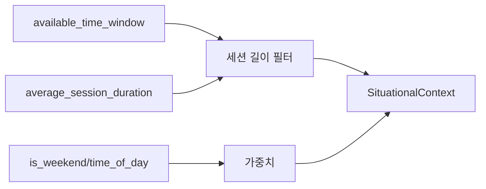

**출력 예시**

- `situational.available_time_window`: `"30m" | "60m" | "120m_plus"`
- `situational.average_session_duration_min`: `float`
- `situational.is_weekend`: `bool`
- `situational.time_of_day`: `"morning"|"afternoon"|"evening"|"night"`

---

### 4.2 플레이 스타일 컨텍스트 (Play Style)

**목적**: “이 유저는 어떻게 게임을 플레이하는가?”를 단순 피처로 요약한다.

**입력(원천)**
- `playtime_forever`
- `playtime_2weeks`

**핵심 파생 로직(PDF 그대로)**

- 평균 누적 플레이 시간(하드코어/캐주얼)
  - \(\text{avg\_lifetime\_hours} = \sum(\text{playtime\_forever}) / 60\)
- 집중도 점수(Focus Score)
  - \(\text{focus\_score} = mean(\text{playtime\_2weeks} / \text{playtime\_forever})\) for recently played games
- 플레이 스타일 분류
  - `focus_score > 0.3` → `"Focused"` else `"Diverse"`
- 난이도 선호(초기 휴리스틱)
  - `recent_playtime/total_playtime` 임계치 기반으로 `"Challenging"` vs `"Relaxed"`

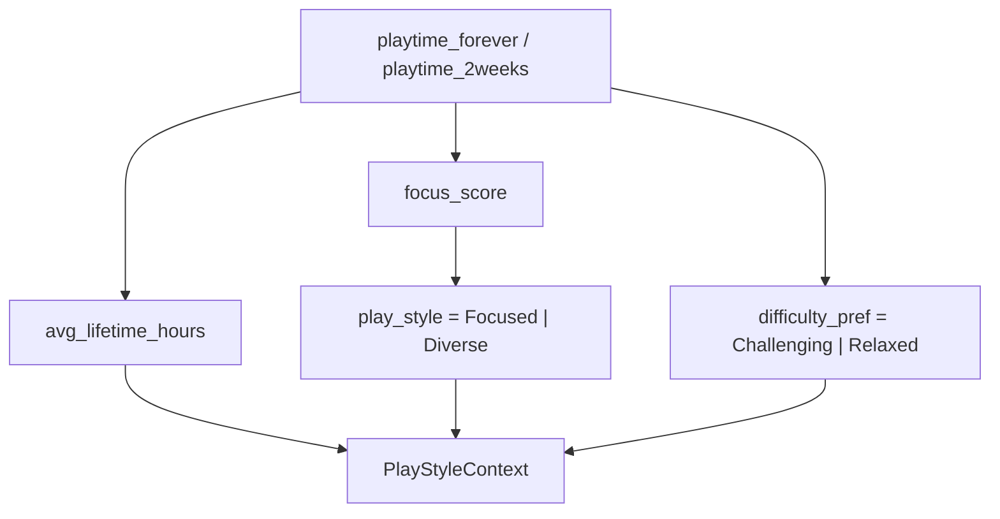

**출력 예시**

- `play_style.avg_lifetime_hours`: `float`
- `play_style.focus_score`: `float`
- `play_style.play_style`: `"Focused"|"Diverse"`
- `play_style.difficulty_pref`: `"Challenging"|"Relaxed"`

---

### 4.3 최근 행동/활성도 컨텍스트 (Behavior / Activity)

**목적**: 단기 취향/최근성/활동성을 통해 “요즘 맥락”을 잡고 후보 확장의 기준을 만든다.

> 구현 메모(5~8 담당용) 문서: `docs/context_aware_5to8.md`

**핵심 입력**

| 필드 | 의미 | 역할 |
|---|---|---|
| `playtime_2weeks` | 요즘 하고 있나? | 즉시성 신호(Strong) |
| `rtime_last_played` | 아직 맥락에 있나? | 최근성 앵커(Gate) |
| `playtime_forever` | 이 게임이 의미 있었나? | 신뢰도/중요도(Weight) |

**게이팅 예시(PDF 요지)**

- `playtime_forever`는 충분하지만 `playtime_2weeks == 0`이고 `rtime_last_played`가 **3일 전** → “잠깐 쉬는 중” (앵커 유효)
- `rtime_last_played`가 **90일 전** → 현재 맥락 아님(과거 취향 참고용)

**추가 시그널(요약 필드)**

- `top_genres: List[str]` (Steam 최근 게임 + IGDB)
- `top_themes: List[str]` (Steam + IGDB)
- `preferred_modes: List[str]` (Steam + IGDB)
- `avg_recent_play_hours: float` (최근 2주 평균 플레이 시간)
- `total_lifetime_hours: float` (전체 누적)
- `recent_2weeks_hours: float` (최근 2주 합)

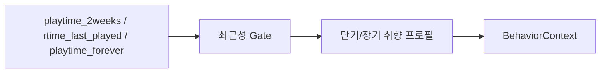

---

### 4.4 심리/감성 컨텍스트 (Sentiment / Persona) (LLM 포함)

**목적**: 유저의 “판단 기준”과 “기피 패턴”을 구조화해 추천/설명에 반영한다.

| 항목 | 출처 | 필드 | 설명 |
|---|---|---|---|
| 판단 기준 | 유저 리뷰 + LLM (Job 4) | `weighted_aspect_preference` | 그래픽/스토리 등 6대 속성 비중 |
| 기피 패턴 | 유저 리뷰 + LLM | `churn_triggers` | “버그/노가다” 등 불호 트리거 |
| 기분/의도 | UI | `current_mood_tag` | “스트레스 해소/감동/성취감” 등 |

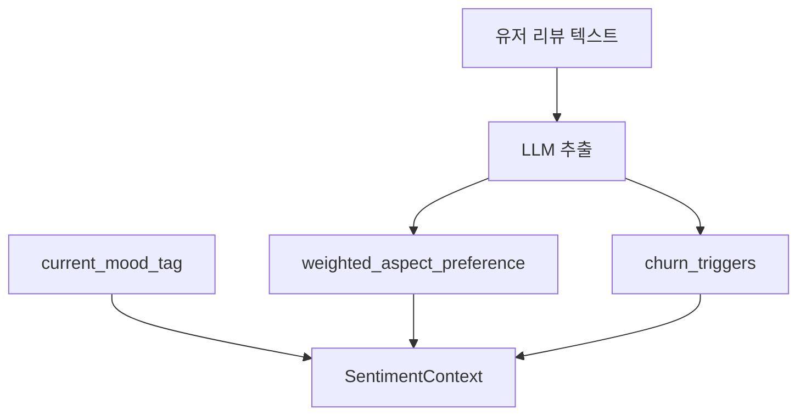

**실무 메모(중복 제거/정합성)**
- 리뷰 기반 모듈은 프로젝트의 “탈-리뷰” 원칙과 충돌할 수 있으므로, **MVP에서는 OFF(선택)** 로 두고 UI 기반 `current_mood_tag`부터 시작해도 된다.
- LLM 결과는 반드시 **고정 스키마(JSON)** 로 저장(재현성/비용 절감).

---

### 4.5 콘텐츠/캐릭터 컨텍스트 (Content / Character) (외부 소스 의존)

**목적**: 세계관/캐릭터/외형 선호(“고양이 캐릭터” 등)를 조건으로 반영한다.

| 항목 | 출처 | 필드 | 설명 |
|---|---|---|---|
| 캐릭터 성격 | IGDB/Fandom/LLM | `char_personality_tags` | 로어 텍스트에서 성격 태그 |
| 외형/종족 | IGDB/VNDB | `char_species`, `char_visual_style` | “고양이/미소녀” 등 |
| 세계관 무드 | RAWG/Steam Tags | `world_setting_tags` | 사이버펑크/아포칼립스 등 |

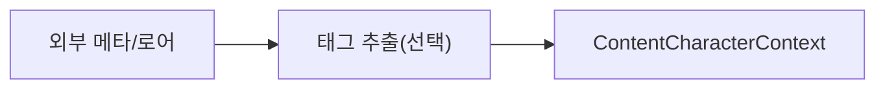

---

### 4.6 서사/캐릭터 톤 컨텍스트 (Narrative Tone) (LLM)

**목적**: 유저 기분/의도와 게임의 정서적 톤을 매칭한다.

**사용 컬럼(원천 → 의미)**

| 원본 컬럼 | 의미(로직) |
|---|---|
| `detailed_description` | 서사/관계/감정 톤 추론 및 벡터화 |
| `achievements[].description` | 서사 중심 vs 보상 중심 성향 |
| `content_descriptors.ids` | 폭력/공포 등 회피 조건 |
| `newsitems[].contents` | 신규 스토리 확장(재진입 동기) |

**API**
- `ISteamUserStats.GetSchemaForGame`: `achievements[].description`
- Store API `/api/appdetails`: `detailed_description`, `about_the_game`, `short_description`

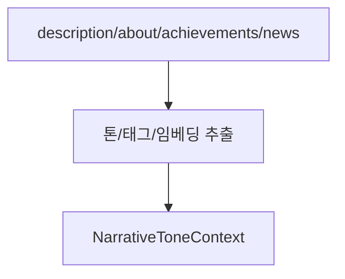

---

### 4.7 게임 완성도/선택지 신뢰도 (Quality / Trust)

**목적**: 추천 후보로서 “완성도/신뢰도”를 정량화해 의사결정에 반영한다.

| 출처 | 컬럼 | 용도 |
|---|---|---|
| UserStats | `achievements.total` | 콘텐츠/목표 설계 밀도 proxy |
| Store | `movies` | 트레일러 제공(완성 단계 신호) |
| Store | `screenshots` | 시각 자료 준비 수준 |
| Store | `recommendations.total` | 사회적 검증 신호 |
| Review | `total_positive / total_reviews` | 사용자 만족도 비율 |
| Review | `total_reviews` | 통계적 신뢰도(표본 보정) |

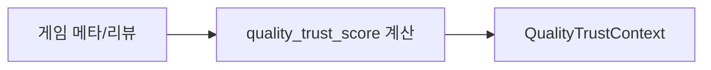

---

### 4.8 라이브 상태 컨텍스트 (Live)

**목적**: “이 게임은 지금도 살아있는가(업데이트/이벤트)”

**API**: `ISteamNews.GetNewsForApp`

| 컬럼 | 의미 | 활용 |
|---|---|---|
| `newsitems[].date` | 작성 시각 | 최근성 |
| `newsitems[].feedlabel` | Update/Event | 라이브 여부 |
| `newsitems[].contents` | 본문 | DLC/시즌/캐릭터 등 신호 |

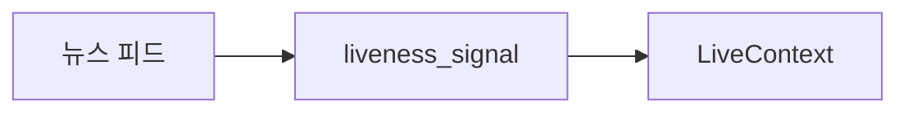

---

### 4.9 할인 컨텍스트 (Discount)

**목적**: “지금 눈에 띌 이유(관심 트리거)가 있는가”

**API**
- Store API `/api/appdetails`: `price_overview.discount_percent`
- (보조) `ISteamApps`: `price_change_number`, `last_modified`

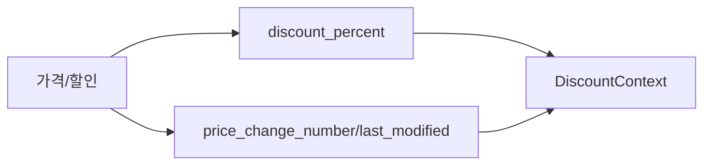

---

## 5. 구현 우선순위(권장)

중복을 줄이기 위해 “당장 가능한 것”부터 쌓습니다.

- **MVP (바로 구현)**: Situational(시간/요일) + PlayStyle + Behavior(최근성 gate)  
  + 게임 단위: Live + Discount + 최소한의 Quality(리뷰 비율/표본)
- **V1**: Narrative Tone(LLM) + Quality 확장(트레일러/스크린샷/추천수)
- **V2(선택)**: Sentiment/Persona(유저 리뷰 LLM) + Content/Character(외부 소스)

---

## 6. 개발 체크리스트

- [ ] `context_bundle` 출력 JSON 스키마 확정(필드명/타입/nullable)
- [ ] Steam API 호출 모듈(레이트리밋/캐시/재시도)
- [ ] 파생 피처 계산 모듈(플레이스타일/최근성 gate)
- [ ] 게임 컨텍스트 수집(Store/UserStats/News/Review) 조인
- [ ] (선택) LLM 추출 결과를 **항상 JSON으로 저장**(재생성 방지)
- [ ] 샘플 유저 3~5명 시나리오로 스냅샷 검증(값이 상식 범위인지)

---