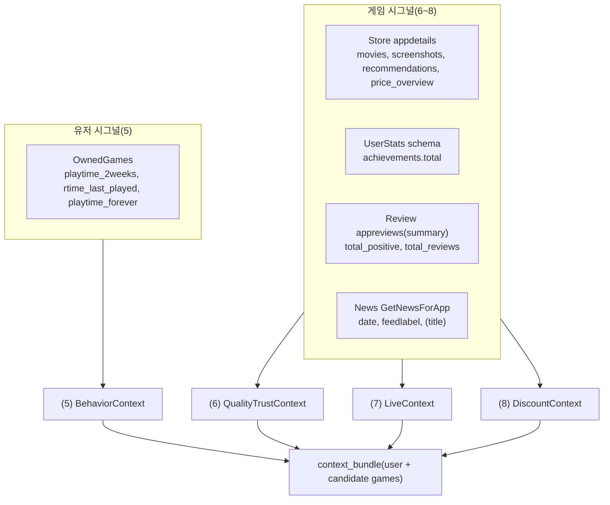

# Context-aware (5~8) 문서 정리본 — 행동/신뢰도/라이브/할인

## 문서 원칙(공통 요구사항)

- **표 우선**: 필드/입력/출력/결측 처리처럼 표로 표현 가능한 부분은 표로 고정합니다.
- **중복 제거**: 출력 스키마/필드는 `2.6 데이터 계약`을 단일 진실(Single Source of Truth)로 사용합니다.
- **raw 보존 + 정규화**: 원본 응답은 `data/raw/`에 보존하고, 로직 투입 전 **정규화(interim)** → **컨텍스트 번들(processed)** 로 분리합니다.
- **수집 전략 분리**
  - **(5)**: 유저 단위 신호 → 요청 시점(on-demand) 계산 가능
  - **(6~8)**: 게임(appid) 단위 신호 → 배치 캐시 + TTL(필요 시 온디맨드 보충)

## 작업 진행 순서(체크리스트)

> (5~8) 문서/구현의 최소 완결 기준: 데이터 계약 고정 → raw 수집 규칙 고정 → (5) 스냅샷 + (6~8) 번들 생성 → context_bundle 조립 → (필터링 전) Top-K 데모

- [x] **데이터 계약 확정(MVP v0.1)**: `2.6`
- [x] **raw 저장 규칙 확정**: `2.7`
- [x] (6~8) **게임 신호 raw 수집(배치)**: appdetails/appreviews_summary/schema/news
- [x] (6~8) **interim/processed 번들 + TTL**: 미싱/만료 시 온디맨드 보충
- [x] (5) **OwnedGames → user-game 정규화(interim)** + **BehaviorContext(processed)**
- [x] (6) **QualityTrustContext** 점수(가중치/정규화) 확정 + 검증
- [x] (7) **LiveContext** 분류 규칙/파라미터(tau/alpha, 기간 N) 확정 + 검증
- [x] (8) **DiscountContext** TTL/locale 정책 확정 + 검증
- [x] **context_bundle 조립기**: user(5) + games(6~8) 병합(bundle 생성)
- [x] **샘플 유저 스냅샷 검증**: 값 범위/결측/TTL 동작 확인
- [x] **(필터링 전) Top-K 후보 데모**: `appid/score/reason` 출력(JSON/표/로그 중 택1)

## 목차

- [A. 작업 진행 순서(체크리스트)](#a-작업-진행-순서체크리스트)
- [0. 진행 방식(구현 운영 원칙)](#0-진행-방식구현-운영-원칙)
  - [0.1 권장 디렉토리/파일 구조(트리 + 역할 표)](#01-권장-디렉토리파일-구조트리--역할-표)
- [1. 구현 범위(입력 → 산출)](#1-구현-범위입력--산출)
- [2. 데이터 소스/API 및 수집 전략](#2-데이터-소스api-및-수집-전략)
  - [2.1 수집 전략(유저/게임 분리) — 표](#21-수집-전략유저게임-분리--표)
  - [2.2 API/필드 요약 — 표](#22-api필드-요약--표)
  - [2.5 필드 우선순위(MVP / V1 / V2 / Phase 3) — 표](#25-필드-우선순위mvp--v1--v2--phase-3--표)
  - [2.6 MVP 데이터 계약 확정안 (Data Contract v0.1)](#26-mvp-데이터-계약-확정안-data-contract-v01)
  - [2.7 Raw 저장 규칙(MVP) — 호출 API ↔ raw 파일](#27-raw-저장-규칙mvp--호출-api--raw-파일)
- [3. 출력 스키마(중복 제거: 2.6으로 통합)](#3-출력-스키마중복-제거-26으로-통합)
- [4. (5) 유저 행동/활성도 (Behavior / Activity)](#4-5-유저-행동활성도-behavior--activity)
- [5. (6) 게임 품질/신뢰 (Quality / Trust)](#5-6-게임-품질신뢰-quality--trust)
- [6. (7) 라이브 상태 (Live)](#6-7-라이브-상태-live)
- [7. (8) 할인 (Discount)](#7-8-할인-discount)
- [8. context_bundle 조립/검증(부록)](#8-context_bundle-조립검증부록)

---

## 0. 진행 방식(구현 운영 원칙)

- **MVP 목표**: (5~8) 컨텍스트 4종을 계산해 `context_bundle`(유저 + 후보 게임들)을 만들고, **필터링(Phase 3) 전 단계에서 Top-K 후보가 “동작한다”는 결과**까지 재현 가능하게 합니다.
- **캐시 원칙(6~8)**: `appid` 단위 컨텍스트는 배치로 만들어 `data/processed/`에 저장하고, **TTL 만료/미싱**일 때만 온디맨드로 raw를 보충합니다(특히 할인/가격은 TTL 짧게).
- **재현성**: Store `appdetails`는 locale 영향이 있으므로 **`cc/lang` 고정**을 권장합니다.

### 0.1 권장 디렉토리/파일 구조(트리 + 역할 표)

#### 트리(링크 포함, 권장)

- `src/game_recommendation/`
  - `api/`
    - [`steam_client.py`](../src/game_recommendation/api/steam_client.py): Steam Web/Store/Review/News 호출 래퍼 + raw 저장
  - `context_aware/`
    - [`behavior_activity.py`](../src/game_recommendation/context_aware/behavior_activity.py): (5) BehaviorContext 계산 + user-game 정규화
    - [`game_signals.py`](../src/game_recommendation/context_aware/game_signals.py): (6~8) raw→interim 요약 + processed 번들(TTL)
    - [`quality_trust.py`](../src/game_recommendation/context_aware/quality_trust.py): (6) 단독 Quality/Trust 계산(옵션)
    - [`live.py`](../src/game_recommendation/context_aware/live.py): (7) 단독 Live 계산(옵션)
    - [`discount.py`](../src/game_recommendation/context_aware/discount.py): (8) 단독 Discount 계산(옵션)
    - [`schemas.py`](../src/game_recommendation/context_aware/schemas.py): 공용 스키마(출력 계약 반영)
- `scripts/`
  - [`build_game_signals_cache.py`](../scripts/build_game_signals_cache.py): (6~8) appid 리스트 raw 수집(배치)
  - [`build_game_signals_bundle.py`](../scripts/build_game_signals_bundle.py): (6~8) TTL 번들 생성(온디맨드 보충 포함)
  - [`build_user_behavior_snapshot.py`](../scripts/build_user_behavior_snapshot.py): (5) steam_id 단위 스냅샷 생성(선택: raw 미싱 시 수집 가능)
- `data/`
  - `raw/`: 원본 응답(JSON) 그대로 저장
  - `interim/`: 요약/정규화된 중간 산출물(로직 투입 전)
  - `processed/`: 최종 컨텍스트 번들/모델 입력

---

## 1. 구현 범위(입력 → 산출)



---

## 2. 데이터 소스/API 및 수집 전략

### 2.1 수집 전략(유저/게임 분리) — 표

| 구분 | 책임 범위 | 조인 키 | 기본 수집 방식 | 갱신/TTL 권장 | 운영 포인트 |
|---|---|---|---|---|---|
| (5) 유저 행동/활성도 | “지금 맥락” (최근 2주/마지막 실행) | `steam_id` | **on-demand 계산**(OwnedGames 기반) | 요청 시점 계산(캐시 옵션) | 시간 민감. 결측(`rtime_last_played`) 폴백 필요 |
| (6) 품질/신뢰 | 게임 자체 신호(리뷰/업적/미디어) | `appid` | **배치 캐시 + TTL** | 24h~7d (리뷰/메타는 비교적 완만) | API 비용 큼. 결측 필드(None-safe) 필수 |
| (7) 라이브 | 업데이트/이벤트 최근성 | `appid` | **배치 캐시 + TTL** | 6h~24h (뉴스 변동) | feedlabel 분류가 불안정할 수 있어 규칙 기반 매칭 권장 |
| (8) 할인 | 할인율/가격(트리거) | `appid` + locale | **배치 캐시 + 짧은 TTL** | 6h~24h (할인 변동) | locale(`cc/lang`) 고정 권장. `price_overview` 결측 잦음 |

### 2.2 API/필드 요약 — 표

#### (5) 유저 행동/활성도

| 목적 | API | 필수 필드 | 단위/포맷 | 비고 |
|---|---|---|---|---|
| OwnedGames 기반 행동 신호 | `IPlayerService.GetOwnedGames` | `games[].appid`, `games[].playtime_forever`, `games[].playtime_2weeks`, `games[].rtime_last_played` | 분(min), unix sec | (선택) `GetRecentlyPlayedGames`는 보조 |

#### (6) 품질/신뢰

| 목적 | API | 필수 필드 | 단위/포맷 | 비고 |
|---|---|---|---|---|
| 리뷰 요약(표본/만족도) | Store `appreviews`(summary) | `query_summary.total_positive`, `query_summary.total_reviews` | count | **reviews[]는 받지 않음(MVP 강제)** |
| 업적 밀도 proxy | `ISteamUserStats.GetSchemaForGame` | `achievements.total` | count | 결측 가능(null 허용) |
| 미디어/추천(보조) | Store `appdetails` | `movies`, `screenshots`, `recommendations.total` | list/count | V1 확장 신호 |

#### (7) 라이브

| 목적 | API | 필수 필드 | 단위/포맷 | 비고 |
|---|---|---|---|---|
| 업데이트/이벤트 최근성 | `ISteamNews.GetNewsForApp` | `newsitems[].date`, `newsitems[].feedlabel` (권장: `title`) | unix sec / str | contents 분석은 MVP 제외 |

#### (8) 할인

| 목적 | API | 필수 필드 | 단위/포맷 | 비고 |
|---|---|---|---|---|
| 할인율(트리거) | Store `appdetails` | `price_overview.discount_percent` | 0~100 | 결측이면 0 |
| (표시/비교) 가격 | Store `appdetails` | `price_overview.final`, `initial`, `currency` | minor unit | V1 확장. locale 영향 큼 |

---

## 2.5 필드 우선순위(MVP / V1 / V2 / Phase 3) — 표

> 기준: **(5~8) 점수/신호 계산에 직접 쓰이는가?** + **비용/복잡도/정합성 리스크**

| 모듈 | 필드(입력/출력) | 단계 | 이유/메모 |
|---|---|---|---|
| (5) Behavior | `appid`, `playtime_forever`, `playtime_2weeks`, `rtime_last_played` | MVP | 핵심 입력(즉시성/최근성/중요도) |
| (5) Behavior | `recent_2weeks_hours`, `total_lifetime_hours`, `avg_recent_play_hours`, `activity_state` | MVP | 유저 상태/가중치에 바로 사용 |
| (5) Behavior | `context_anchor_appids` | MVP(선택) | 설명/근거/후속 모듈(콘텐츠 기반) 연결에 유용 |
| (6) Quality/Trust | `total_positive`, `total_reviews`, `review_positive_ratio` | MVP | 만족도 + 표본 크기 핵심 |
| (6) Quality/Trust | `achievements_total` | MVP | 콘텐츠/목표 밀도 proxy(결측 허용) |
| (6) Quality/Trust | `confidence`, `quality_trust_score` | MVP | 비교 가능한 단일 점수 필요 |
| (7) Live | `days_since_last_news`, `recent_update_count`, `recent_event_count`, `liveness_signal` | MVP | 최근성 + 빈도로 충분히 유의미 |
| (8) Discount | `discount_percent`, `discount_signal` | MVP | 트리거로 즉시 사용 가능(결측=0) |
| (6) Quality/Trust | `movies_count`, `screenshots_count`, `recommendations_total` | V1 | 유용하지만 결측/파싱/운영 비용 존재 |
| (7) Live | `newsitems[].contents` 텍스트 분석 | V1~V2 | 규칙/LLM 비용 큼. MVP 제외 |
| (8) Discount | `final/initial/currency` | V1 | 표시에 유용. locale 정책 필요 |
| (5) Behavior | `top_genres` 등 외부 메타 조인 | V2 | Steam 단독으로 불안정/외부 조인 필요 |
| (Phase 3) | spec/price budget/age/language/genre hard filter | Phase 3 | 점수보단 **하드 제약** 성격(문서 범위 밖) |

---

## 2.6 MVP 데이터 계약 확정안 (Data Contract v0.1)

> 목적: 각 모듈이 따로 구현돼도 합치면 동일하게 동작하도록 **입력/출력 필드, 타입, 단위, 결측 기본값**을 고정합니다.

### 2.6.1 공통 규칙(필수)

| 항목 | 규칙 |
|---|---|
| 조인 키 | `steam_id: str`, `appid: int` |
| 단위 강제(네이밍) | `*_hours: float`, `*_ts: int(UTC unix sec)`, `*_days: int`, `*_percent: int(0~100)`, `*_ratio/_score/_signal: float(0~1, 필요 시 clamp)` |
| 시간 기준 | now는 **UTC** 기준(서버 로컬 시간 금지) |
| 결측 처리 원칙 | “의미 있는 0”은 0 허용(할인율, 리뷰 수 등). “없음/미확인” 자체가 의미면 nullable 허용(마지막 뉴스 등). |

### 2.6.2 (5) 입력 정규화 레코드(OwnedGames row)

| field | type | unit/format | nullable | default | note |
|---|---:|---|---:|---|---|
| `appid` | int | - | no | - | join key |
| `playtime_forever_hours` | float | hours | no | 0.0 | `playtime_forever / 60` |
| `playtime_2weeks_hours` | float | hours | no | 0.0 | 없으면 0 |
| `rtime_last_played_ts` | int | unix sec | yes | null | `0`이면 `null` |

### 2.6.3 (6) 입력 정규화 레코드(품질/신뢰 최소)

| field | type | unit/format | nullable | default | source |
|---|---:|---|---:|---|---|
| `total_reviews` | int | count | no | 0 | appreviews `query_summary.total_reviews` |
| `total_positive` | int | count | no | 0 | appreviews `query_summary.total_positive` |
| `achievements_total` | int | count | yes | null | schema `achievements.total` |

### 2.6.4 (7) 입력 정규화 레코드(라이브 최소)

| field | type | unit/format | nullable | default | source |
|---|---:|---|---:|---|---|
| `newsitems` | list[dict] | raw list | yes | null | `GetNewsForApp` |

> MVP에서는 `newsitems[].date`, `newsitems[].feedlabel`(권장: `title`)만 사용해 파생값을 만들고, `contents` 분석은 하지 않습니다.

### 2.6.5 (8) 입력 정규화 레코드(할인 최소)

| field | type | unit/format | nullable | default | source |
|---|---:|---|---:|---|---|
| `discount_percent` | int | 0~100 | no | 0 | Store `price_overview.discount_percent` (없으면 0) |

### 2.6.6 (5~8) 출력 계약(필드/타입/기본값)

#### BehaviorContext (MVP)

| field | type | unit/format | nullable | default |
|---|---:|---|---:|---|
| `recent_2weeks_hours` | float | hours | no | 0.0 |
| `total_lifetime_hours` | float | hours | no | 0.0 |
| `avg_recent_play_hours` | float | hours | no | 0.0 |
| `activity_state` | str | enum | no | `"dormant"` |
| `context_anchor_appids` | list[int] | appid list | yes | null |

`activity_state`는 `"active" | "cooling_off" | "dormant"` 중 하나.

#### QualityTrustContext (MVP)

| field | type | unit/format | nullable | default |
|---|---:|---|---:|---|
| `review_positive_ratio` | float | 0~1 | no | 0.0 |
| `total_reviews` | int | count | no | 0 |
| `achievements_total` | int | count | yes | null |
| `confidence` | float | 0~1 | no | 0.0 |
| `quality_trust_score` | float | 0~1 | no | 0.0 |

#### LiveContext (MVP)

| field | type | unit/format | nullable | default |
|---|---:|---|---:|---|
| `days_since_last_news` | int | days | yes | null |
| `recent_update_count` | int | count | no | 0 |
| `recent_event_count` | int | count | no | 0 |
| `liveness_signal` | float | 0~1 | no | 0.0 |

#### DiscountContext (MVP)

| field | type | unit/format | nullable | default |
|---|---:|---|---:|---|
| `discount_percent` | int | 0~100 | no | 0 |
| `discount_signal` | float | 0~1 | no | 0.0 |

---

## 2.7 Raw 저장 규칙(MVP) — 호출 API ↔ raw 파일

> 목적: 호출 규칙과 raw 저장 규칙을 고정해, 배치 수집기/온디맨드 보충이 같은 형태로 raw를 쌓도록 합니다.

### 2.7.1 MVP에서 호출하는 API 목록(클라이언트 메서드 기준)

| 목적(모듈) | SteamClient 메서드 | 호출 API | raw 저장 키 |
|---|---|---|---|
| (5) 유저 행동 | `get_owned_games(steam_id)` | `IPlayerService.GetOwnedGames` | `steam_id` |
| (6) 품질/신뢰 | `get_appreviews_summary(appid)` | Store `appreviews` | `appid` |
| (6) 품질/신뢰 | `get_schema_for_game(appid)` | `ISteamUserStats.GetSchemaForGame` | `appid` |
| (7) 라이브 | `get_news_for_app(appid)` | `ISteamNews.GetNewsForApp` | `appid` |
| (8) 할인 | `get_appdetails(appid, cc, lang)` | Store `appdetails` | `appid` (+ `cc/lang`) |

### 2.7.2 raw 저장 파일 규칙(권장 경로)

| API | raw 파일 경로(권장) | 저장 내용 |
|---|---|---|
| OwnedGames | `data/raw/owned_games/{steam_id}.json` | 원본 JSON 전체 |
| appreviews(summary) | `data/raw/appreviews_summary/{appid}.json` | summary 요청의 원본 JSON |
| schema | `data/raw/schema/{appid}.json` | 원본 JSON 전체 |
| news | `data/raw/news/{appid}.json` | 원본 JSON 전체 |
| appdetails | `data/raw/appdetails/{appid}__cc={cc}__lang={lang}.json` | 원본 JSON 전체(locale 영향) |

### 2.7.3 요청 파라미터 고정(용량/재현성)

| 항목 | 규칙 | 이유 |
|---|---|---|
| appreviews | `num_per_page=0` 등으로 **reviews[] 미수신** | MVP는 `query_summary`만 필요(용량/비용 절감) |
| appdetails | `cc/lang` 고정(권장: `us/en`) | locale에 따른 응답 차이로 raw 캐시 흔들림 방지 |
| news | `count/maxlength` 상한(권장) | MVP는 date/feedlabel 중심(과도한 본문 수신 방지) |

---

## 3. 출력 스키마(중복 제거: 2.6으로 통합)

이 문서의 **출력 스키마/필드 정의는 `2.6.6 (5~8) 출력 계약`으로 통합**했습니다.  
추가 다이어그램이 필요하면 `2.6.6` 표를 근거로 생성하되, **필드 정의는 2.6.6만 수정**합니다.

---

## 4. (5) 유저 행동/활성도 (Behavior / Activity)

### 4.1 핵심 개념

| 입력 신호 | 의미 | 사용처 |
|---|---|---|
| `playtime_2weeks` | 즉시성(Strong) | “요즘 하는 게임/맥락” |
| `rtime_last_played` | 최근성 gate | 맥락 포함/제외 판단 |
| `playtime_forever` | 중요도 weight | 유저에게 의미 있었는지 |

### 4.2 파생 피처(권장) — 표

| 파생값 | 정의(권장) | 결측/폴백 |
|---|---|---|
| `recent_2weeks_hours` | `sum(playtime_2weeks_hours)` | 기본값 0 |
| `total_lifetime_hours` | `sum(playtime_forever_hours)` | 기본값 0 |
| `avg_recent_play_hours` | `mean(playtime_2weeks_hours)`(최근 플레이 게임만) | 대상 없으면 0 |
| `days_since_last_played` | `now - max(rtime_last_played_ts)` | last_played가 전부 null이면 null |
| `activity_state` | 아래 게이팅 규칙 | 폴백 규칙 적용 |
| `context_anchor_appids` | “요즘 맥락 게임” 리스트 | 옵션(null 허용) |

#### activity_state 게이팅(권장 규칙)

| 상태 | 규칙(예시) | 설정값 |
|---|---|---|
| `active` | `recent_2weeks_hours > X` | X (예: 5h) |
| `cooling_off` | `recent_2weeks_hours <= X` AND `days_since_last_played <= Y` | Y (예: 7~14일) |
| `dormant` | `days_since_last_played > Y` 또는 판단 불가 | - |

폴백(권장):
- `rtime_last_played_ts`가 결측이라도 `recent_2weeks_hours > 0`이면 “최근 플레이”는 확실하므로 `cooling_off`로 둘 수 있습니다.

#### “요즘 맥락 게임(context_anchor_appids)” 추출(예시)

| 우선순위 | 포함 조건(예시) | 정렬/상한 |
|---|---|---|
| 1 | `playtime_2weeks_hours > 0` | `playtime_2weeks_hours` 내림차순 |
| 2 | `playtime_2weeks_hours == 0` 이더라도 `days_since_last_played <= 3` AND `playtime_forever_hours >= 80` | 상한 `max_anchors` 적용 |

### 4.3 구현 연결(코드/산출물) — 표

| 구분 | 위치 | 설명 |
|---|---|---|
| 정규화 로직 | [`src/game_recommendation/context_aware/behavior_activity.py`](../src/game_recommendation/context_aware/behavior_activity.py) | 분→시간 변환, `rtime_last_played==0`→null |
| interim | `data/interim/user_games/{steam_id}.json` | `2.6.2` 형태의 user-game rows |
| processed | `data/processed/user_behavior/{steam_id}.json` | BehaviorContext(+ 선택 `_debug`) |
| 스냅샷 스크립트 | [`scripts/build_user_behavior_snapshot.py`](../scripts/build_user_behavior_snapshot.py) | raw 기반 생성(선택: 미싱이면 수집) |

---

## 5. (6) 게임 품질/신뢰 (Quality / Trust)

### 5.1 목표

“이 게임을 추천 후보로 올려도 되나?”를 정량화해 **비교 가능한 지표**(`quality_trust_score`)로 제공합니다.

### 5.2 구성 신호 — 표

| 신호 | 입력 필드 | 의미 |
|---|---|---|
| 리뷰 만족도 | `total_positive/total_reviews` | 사용자 만족도 |
| 표본 크기(신뢰) | `total_reviews` | 표본이 작으면 점수 신뢰 낮음 |
| 제작/콘텐츠 밀도 | `achievements_total` | 목표/콘텐츠 밀도 proxy |
| 준비 수준(보조) | `movies`, `screenshots`, `recommendations.total` | V1 확장 신호 |

### 5.3 점수 설계(권장: 단순 가중 합 + confidence 보정)

| 항목 | 권장 정의(예시) | 비고 |
|---|---|---|
| `review_positive_ratio` | `total_positive / max(total_reviews, 1)` | 0~1 |
| `confidence` | `min(1.0, log10(total_reviews + 1) / log10(10000))` | 표본이 커질수록 1에 수렴 |
| `quality_trust_score` | `(w1*ratio + w2*achievements + w3*media + w4*reco) * confidence` | 초기엔 w1만 크게 시작해도 됨 |

### 5.4 구현 연결(코드/산출물) — 표

| 구분 | 위치 | 설명 |
|---|---|---|
| raw 배치 수집 | [`scripts/build_game_signals_cache.py`](../scripts/build_game_signals_cache.py) | appdetails/appreviews_summary/schema/news raw 저장 |
| raw→interim/processed | [`src/game_recommendation/context_aware/game_signals.py`](../src/game_recommendation/context_aware/game_signals.py) | 요약/정규화 + TTL 번들 생성 |
| TTL 번들 실행 | [`scripts/build_game_signals_bundle.py`](../scripts/build_game_signals_bundle.py) | 미싱/만료 시 온디맨드 보충 포함 |
| processed | `data/processed/game_bundles/{appid}__cc={cc}__lang={lang}.json` | (6~8) 포함 번들 |

### 5.5 구현 완료 내용(현재 코드 기준)

| 항목 | 결정/구현 |
|---|---|
| 구현 파일(단일 진실) | [`src/game_recommendation/context_aware/quality_trust.py`](../src/game_recommendation/context_aware/quality_trust.py) |
| 번들 생성에서의 호출 | [`src/game_recommendation/context_aware/game_signals.py`](../src/game_recommendation/context_aware/game_signals.py) 가 interim을 넣어 `compute_quality_trust_context(interim)` 호출 |
| 핵심 입력(interim) | `reviews.review_positive_ratio`, `reviews.total_reviews`, `schema.achievements_total(없으면 null)`, `appdetails.movies_count/screenshots_count/recommendations_total` |
| confidence(신뢰도) | `min(1.0, log10(total_reviews + 1) / log10(10000))` |
| 정규화(0~1) | `ach_norm = min(1, achievements/200)`, `media_norm = (movies>0 ? 0.4 : 0) + min(0.6, screenshots/20*0.6)`, `reco_norm = min(1, log10(reco+1)/log10(1_000_000))` |
| 점수 | `quality_trust_score = clamp01((w_ratio*ratio + w_ach*ach_norm + w_media*media_norm + w_reco*reco_norm) * confidence)` (초기 가중치: 0.65/0.15/0.10/0.10) |
| 결측 처리(계약 정합) | `achievements_total`은 **nullable 유지**(스키마에서 achievements 배열이 없으면 null). 점수 계산에서는 null을 0으로 취급 |
| 출력 필드(MVP 계약) | `review_positive_ratio`, `total_reviews`, `achievements_total(null 가능)`, `confidence`, `quality_trust_score` |

---

## 6. (7) 라이브 상태 (Live)

### 6.1 목표

“지금도 업데이트/이벤트가 있는 살아있는 게임인가?”를 요약해 **재진입/관심 트리거**로 제공합니다.

### 6.2 추천 지표 — 표

| 파생값 | 정의(권장) | 결측 처리 |
|---|---|---|
| `days_since_last_news` | `now - max(newsitems.date)` | news가 없으면 null |
| `recent_update_count` | 최근 N일(예: 30) 내 update 분류 개수 | 기본값 0 |
| `recent_event_count` | 최근 N일(예: 30) 내 event 분류 개수 | 기본값 0 |
| `liveness_signal` | `exp(-days/tau) + alpha*(update_count+event_count)` | tau/alpha는 설정값 |

분류(권장):
- `feedlabel`이 불안정할 수 있어 `"update"`, `"event"`는 **소문자 포함 매칭** 기반으로 분류합니다.

### 6.3 구현 연결(코드/산출물) — 표

| 구분 | 위치 | 설명 |
|---|---|---|
| raw | `data/raw/news/{appid}.json` | GetNewsForApp 원본 |
| processed | `data/processed/game_bundles/{appid}__cc={cc}__lang={lang}.json` | LiveContext 포함 |
| 로직(단일 진실) | [`src/game_recommendation/context_aware/live.py`](../src/game_recommendation/context_aware/live.py) | MVP는 contents 분석 제외(최근성/카운트) |
| 번들 연결 | [`src/game_recommendation/context_aware/game_signals.py`](../src/game_recommendation/context_aware/game_signals.py) | `build_processed_game_bundle()`에서 `compute_live_context(interim, now_ts=now_ts)` 호출 |

### 6.4 구현 완료 내용(현재 코드 기준)

| 항목 | 결정/구현 |
|---|---|
| 구현 파일(단일 진실) | [`src/game_recommendation/context_aware/live.py`](../src/game_recommendation/context_aware/live.py) |
| 핵심 입력(interim) | `news.newsitems[]`의 `date`, `feedlabel` (MVP에서 `contents` 미사용) |
| days_since_last_news | `max(newsitems.date)`가 없으면 `null`, 있으면 `max(0, int((now_ts - last_date)/86400))` |
| 최근 카운트 기간 | `window_days`(기본 30일) 동안의 아이템만 집계 |
| feedlabel 분류 | 소문자 포함 매칭: `"update"|"patch"` → update, `"event"|"sale"` → event, 그 외 other |
| liveness_signal | `clamp01(exp(-days_since_last / tau_days) + alpha*(update_count + event_count))` |
| 기본 파라미터 | `window_days=30`, `tau_days=30.0`, `alpha=0.05` |
| 결측 처리 | 뉴스가 전혀 없으면 `days_since_last_news=null`, 카운트=0, `liveness_signal=0.0` |

---

## 7. (8) 할인 (Discount)

### 7.1 목표

할인은 “추천의 주 기준”이 아니라 **노출/클릭을 유도하는 트리거**로 사용합니다.

### 7.2 추천 지표 — 표

| 파생값 | 정의(권장) | 결측 처리 |
|---|---|---|
| `discount_percent` | Store `price_overview.discount_percent` | 없으면 0 |
| `discount_signal` | `discount_percent / 100.0` | 0~1 |

운영 권장:
- 할인/가격은 변동이 잦으므로 **짧은 TTL(예: 6~24h)** 을 권장합니다.

### 7.3 구현 연결(코드/산출물) — 표

| 구분 | 위치 | 설명 |
|---|---|---|
| raw | `data/raw/appdetails/{appid}__cc={cc}__lang={lang}.json` | locale 영향 있음 |
| processed | `data/processed/game_bundles/{appid}__cc={cc}__lang={lang}.json` | DiscountContext 포함 |
| 로직(단일 진실) | [`src/game_recommendation/context_aware/discount.py`](../src/game_recommendation/context_aware/discount.py) | `price_overview` None-safe 파싱(=interim의 `discount_percent`) |
| 번들 연결 | [`src/game_recommendation/context_aware/game_signals.py`](../src/game_recommendation/context_aware/game_signals.py) | `build_processed_game_bundle()`에서 `compute_discount_context(interim)` 호출 |

### 7.4 구현 완료 내용(현재 코드 기준)

| 항목 | 결정/구현 |
|---|---|
| 구현 파일(단일 진실) | [`src/game_recommendation/context_aware/discount.py`](../src/game_recommendation/context_aware/discount.py) |
| 핵심 입력(interim) | `appdetails.discount_percent` (Store `price_overview.discount_percent`에서 정규화된 값) |
| discount_percent | int, 0~100로 clamp, 결측이면 0 |
| discount_signal | `discount_percent / 100.0` (0~1) |
| locale 정책 | raw 파일명에 `cc/lang`가 포함되므로 **권장: `cc/lang` 고정**(예: `us/en`) |
| TTL 권장 | 할인/가격 변동이 잦아 **짧은 TTL(예: 6~24h)** 권장 (`scripts/build_game_signals_bundle.py --ttl-hours`) |

---

## 8. context_bundle 조립/검증(부록)

| 항목 | 내용 |
|---|---|
| 조립 모듈(단일 진실) | [`src/game_recommendation/context_aware/context_bundle.py`](../src/game_recommendation/context_aware/context_bundle.py) |
| CLI 스크립트 | [`scripts/build_context_bundle.py`](../scripts/build_context_bundle.py) |
| 입력(유저) | `data/processed/user_behavior/{steam_id}.json` |
| 입력(게임) | `data/processed/game_bundles/{appid}__cc={cc}__lang={lang}.json` |
| 출력 | `data/processed/context_bundles/{steam_id}__cc={cc}__lang={lang}.json` |
| 검증 | 범위 체크(0~1/0~100), activity_state enum, TTL 만료(stale), 번들 누락(missing) 리포트 |

실행 예시:

```bash
# (0) 전제: STEAM_API_KEY가 .env 또는 config/.env에 있어야 함

# (1) (6~8) game_bundles 생성(TTL 포함) — 먼저 있어야 context_bundle에 games가 채워짐
python3 -m scripts.build_game_signals_bundle --appids 570,730 --cc us --lang en --ttl-hours 24

# (2) context_bundle 조립 + 검증(값 범위/결측/missing)
python3 -m scripts.build_context_bundle --steam-id 76561198125764214 --appids 570,730 --include-game-bundle-meta --validate --strict

# (선택) anchors(BehaviorContext의 context_anchor_appids)로 조립하고 싶으면,
# 해당 appid들에 대해 (1)에서 game_bundles를 먼저 만들어 둬야 missing_appids가 안 뜸
python3 -m scripts.build_context_bundle --steam-id 76561198125764214 --from-anchors --include-game-bundle-meta --validate

# (3) TTL 동작 확인(만료/재생성): TTL을 아주 짧게 두고 만료를 유도
python3 -m scripts.build_game_signals_bundle --appids 570,730 --cc us --lang en --ttl-hours 0.001 --force
sleep 5
python3 -m scripts.build_context_bundle --steam-id 76561198125764214 --appids 570,730 --include-game-bundle-meta --validate
```

### 8.3 (필터링 전) Top-K 후보 데모

| 항목 | 내용 |
|---|---|
| 데모 모듈(스코어링) | [`src/game_recommendation/context_aware/topk_demo.py`](../src/game_recommendation/context_aware/topk_demo.py) |
| 데모 스크립트 | [`scripts/demo_topk_candidates.py`](../scripts/demo_topk_candidates.py) |
| 입력 | `data/processed/context_bundles/{steam_id}__cc={cc}__lang={lang}.json` |
| 출력 | `appid/score/reason` Top-K JSON(stdout) |
| 점수(데모) | `0.60*quality_trust_score + 0.25*liveness_signal + 0.15*discount_signal` (가중치는 인자로 조절 가능) |

실행 예시:

```bash
python3 -m scripts.demo_topk_candidates \
  --bundle data/processed/context_bundles/76561198125764214__cc=us__lang=en.json \
  --top-k 10
```
