# 게임 추천 시스템 프로젝트 워크플로우

## 목차

1. [전략 요약](#1-전략-요약)
2. [추천 아키텍처 원칙: Retrieval-first (Top-K)](#2-추천-아키텍처-원칙-retrieval-first-top-k)
3. [전체 워크플로우(End-to-End)](#3-전체-워크플로우end-to-end)
4. [Phase별 상세 진행 계획](#4-phase별-상세-진행-계획)
5. [최종 체크리스트](#5-최종-체크리스트)

---

## 1. 전략 요약

### 0) 스팀 내부 추천 시스템 분석 (Benchmarking)

- **스팀(참고)**: 플레이 기록/행동 로그/인기도/출시일 중심
- **우리(차별화)**: **탈-태그/리뷰**(주관적 지표 축소) + **출시일/실제 플레이 기반 신호 강화**  
  또한 스팀이 상대적으로 덜 전면에 두는 **하드웨어/가격/연령/언어**를 “조건 필터”의 핵심 축으로 사용

### 1) 3대 핵심 축

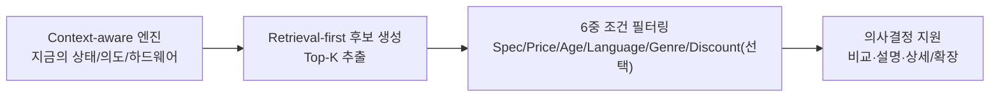

#### A. Context-aware (유저 상태 및 하드웨어 기반)

- **핵심 질문**: “이 사람이 과거에 뭘 좋아했나?”보다 “**지금 이 순간** 뭘 할 수 있고, 뭘 하고 싶은가?”
- **입력**:
  - **세션 기반**: 최근 1~7일 플레이, 세션 길이(몰입도), 시간/요일(주말/밤 등)
  - **사용자 데이터**: 라이브러리 보유/최근 선호 장르(가능한 범위에서)
  - **하드웨어 데이터**: GPU/CPU/RAM 등 현재 기기 사양
  - **명시적 UI 선택**: “가볍게 한 판”, “스토리 몰입” 등 의도

#### B. 6중 지능형 조건 필터링 (3x2 Matrix Filtering)

추천된 후보군을 아래 6가지 조건으로 정밀 필터링해 “환경에 맞는 결과만” 남깁니다.

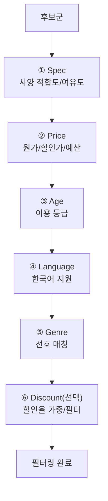

#### C. 의사결정 지원 (Decision Support)

- **Top-K 비교 대시보드**: 사양 적합도, 현재 가격(원가/할인가), 연령 등급, 언어 지원을 한 화면에 비교
- **상세/확장**: 이미지, 스팀 상점 링크, 유사 게임 추천
- **(선택)**: Top-K 범위 내에서만 LLM으로 **설명/재랭킹**

---

## 2. 추천 아키텍처 원칙: Retrieval-first (Top-K)

**유저 컨텍스트를 LLM에 직접 넣어 “전체 추천”을 받지 않습니다.**  
ML 시스템의 정석인 **후보 검색(Retrieval) → Top-K 선택 → (선택) 재랭킹/설명**을 따릅니다.

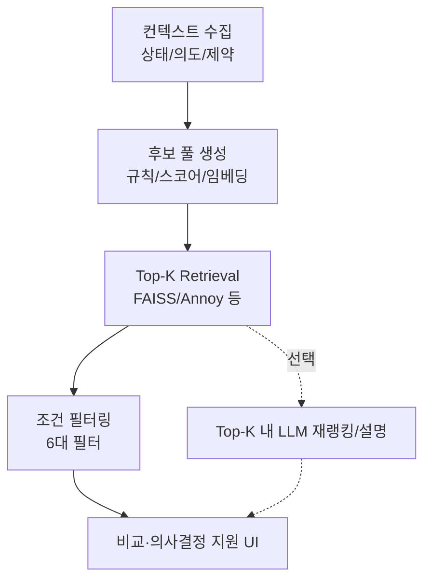

- **LLM 역할 제한**: 전체 후보가 아니라 **Top-K 후보 메타데이터**만 입력으로 사용
- **비교 가능 구조**: Retrieval/필터/가중치를 바꿔도 동일한 파이프라인 형태 유지

---

## 3. 전체 워크플로우(End-to-End)

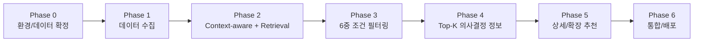

---

## 4. Phase별 상세 진행 계획

### Phase 0: 환경 및 데이터 확정

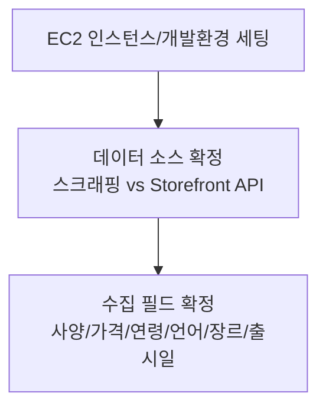

- **데이터 소스**: 스팀 스크래핑 및 Storefront API 활용 방안 확정
- **환경 구축**: AWS EC2 (m7i-flex.large) 기반 개발 환경 세팅

---

### Phase 1: 데이터 수집 (Data Ingestion)

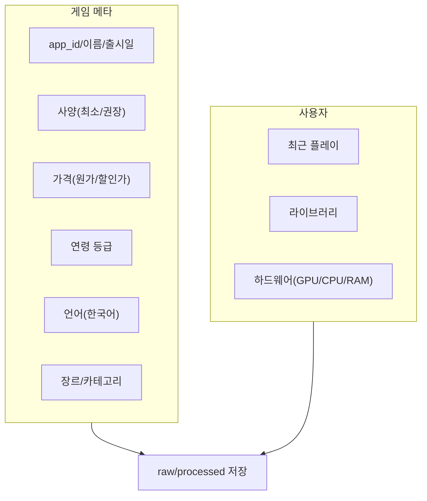

- **게임 메타 데이터**: 앱 ID, 이름, 출시일, 사양, 가격(원가/할인가), 연령 등급, 지원 언어, 장르
- **사용자 데이터**: Steam API 기반 최근 플레이/라이브러리/하드웨어 사양(가능 범위에서)

---

### Phase 2: Context-aware 엔진 구현 (Context-aware끼리)

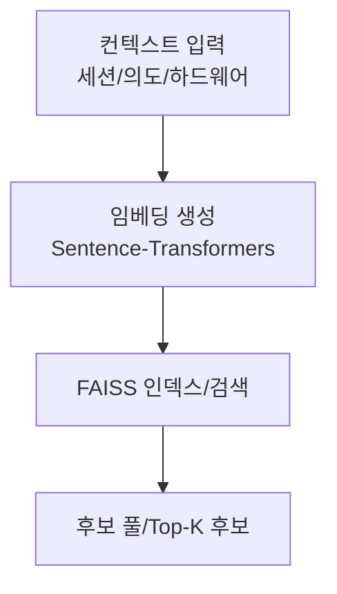

- **임베딩 및 검색**: Sentence-Transformers + FAISS로 컨텍스트 기반 후보 추출
- **출력**: “필터링 전” 후보 풀/Top-K 후보

---

### Phase 3: 지능형 조건 필터링 (조건 필터링끼리)

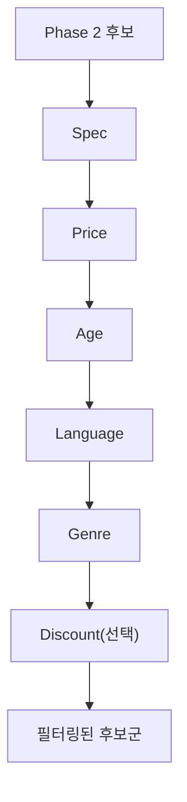

- **수평적 필터링**: 6대 필터(사양/가격/연령/언어/장르/할인율) 연동
- **가격 정보 고도화**: 원가·할인가 동시 관리, 할인 폭 가중/필터 옵션

---

### Phase 4: Top-K 의사결정 정보 제공

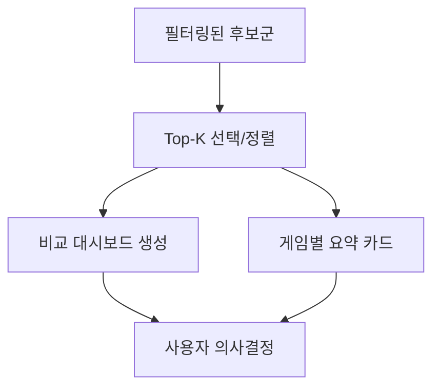

- **비교 UI 설계**: 하드웨어 가용성, 현재 가격(원가/할인가), 연령 등급, 언어 지원을 한눈에
- **추천 결과 출력 버킷팅(Owned 제외/포함 정책)**: “필터링”이 아니라 **출력/UX 정책**으로 다룹니다.
  - **New(Discovery) 추천**: 기본값은 **미보유 게임만** 노출(“새 게임 발견” 목적)
  - **Rediscover(Re-engagement) 추천**: 보유 게임 중 “오래 안 한 게임”을 별도 섹션으로 노출(“복귀/리마인드” 목적)
    - 예시 기준(초기값, 설정으로 분리):
      - `playtime_2weeks == 0`
      - `days_since_last_played >= N` (예: 30일)
      - `playtime_forever >= M` (예: 20~80시간) — 과거 선호/중요도 proxy
  - **토글/옵션**: 사용자 설정으로 “보유 게임 포함/제외”를 선택 가능하게 설계(제품 목표에 따라 기본값 결정)

---

### Phase 5: 상세 페이지 및 확장 추천

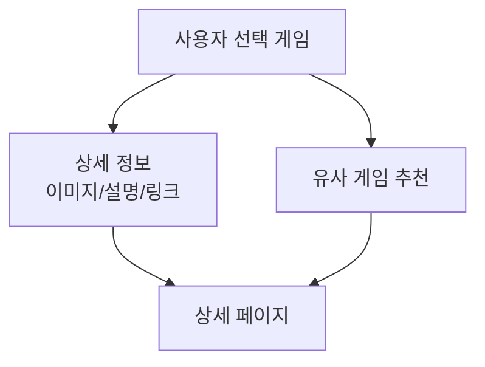

- **디테일 연동**: 고화질 이미지, 상세 설명, 스팀 링크
- **확장 추천**: 유사도 기반 추천(선택한 게임 중심)
- **(선택)**: 캐릭터 챗봇 인터페이스 연결

---

### Phase 6: 시스템 통합 및 배포

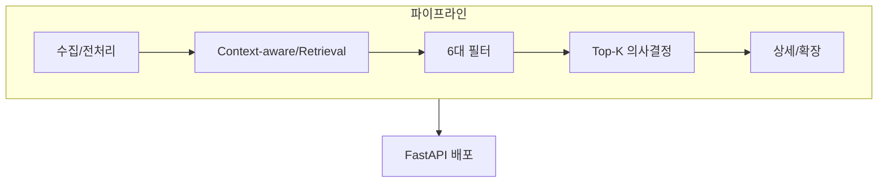

- **통합 테스트**: 전체 파이프라인 결합 및 검증
- **배포**: FastAPI 기반 서비스화

---

## 5. 최종 체크리스트

- [ ] **Phase 0**: 인스턴스 환경 및 데이터 소스/필드 확정
- [ ] **Phase 1**: 게임 메타(원가/할인가/연령 포함) + 사용자 데이터 확보
- [ ] **Phase 2**: FAISS 기반 Context-aware 후보군 추출 엔진 구현
- [ ] **Phase 3**: 6대 지능형 필터(사양/가격/연령/언어/장르/할인율) 연동
- [ ] **Phase 4**: Top-K 후보군 의사결정 지표/비교 UI 설계
- [ ] **Phase 5**: 상세 페이지 연동 및 확장 추천(선택: 챗봇)
- [ ] **Phase 6**: 통합 테스트 및 최종 배포

---