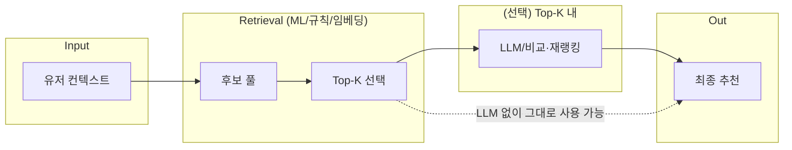
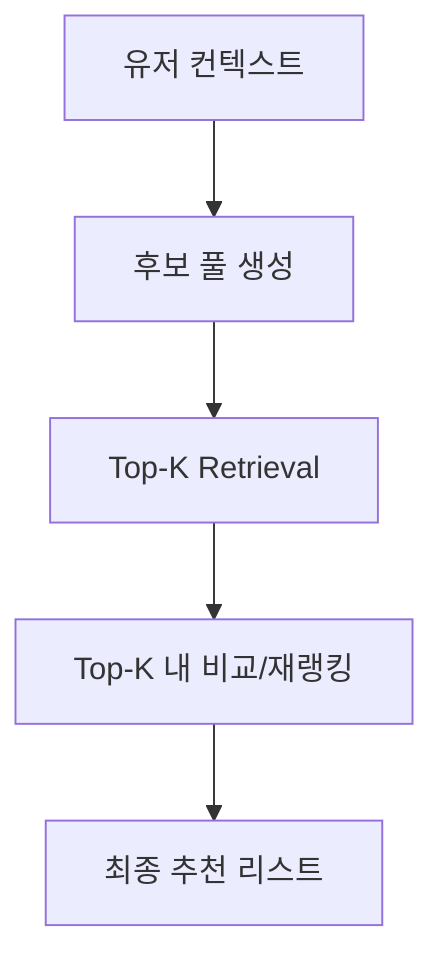
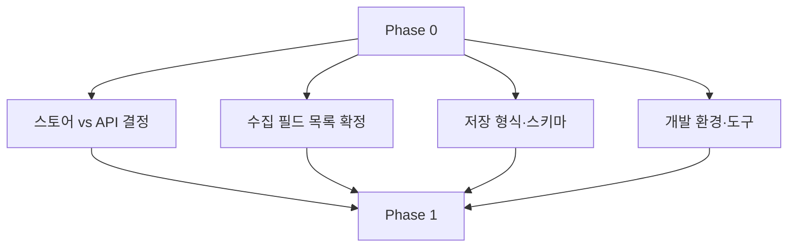
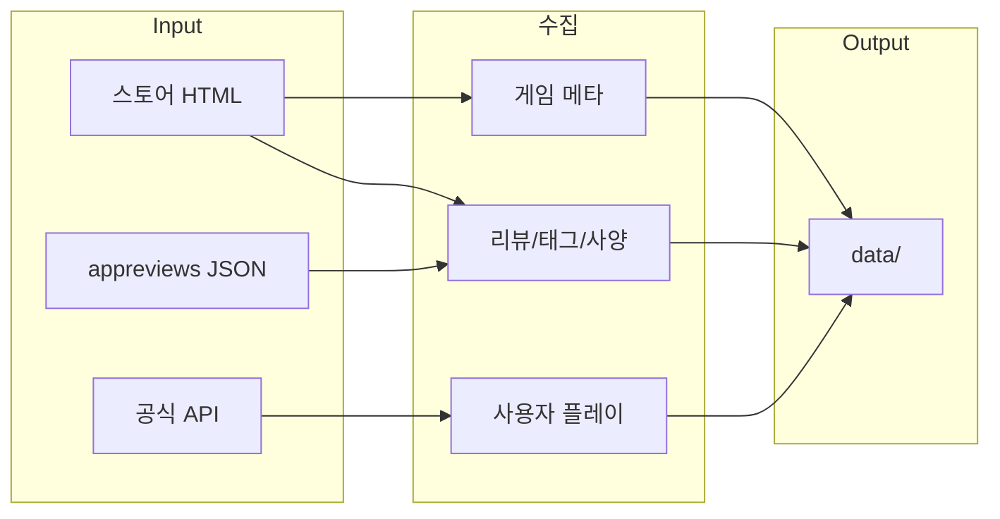
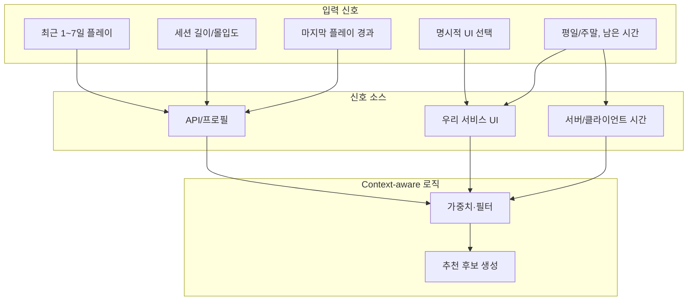
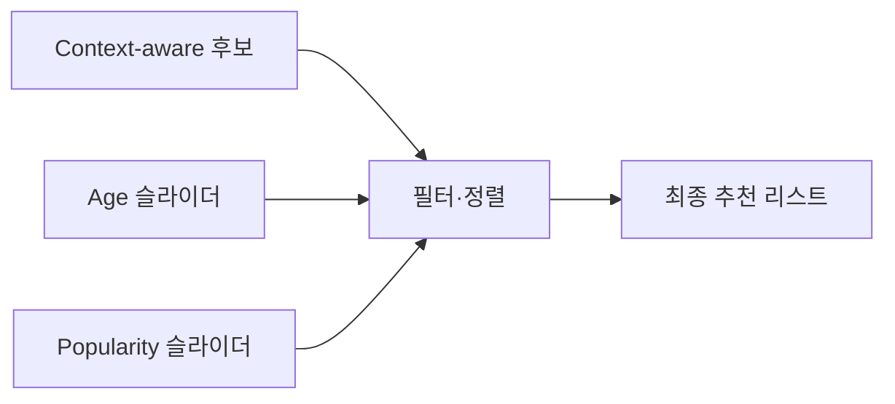
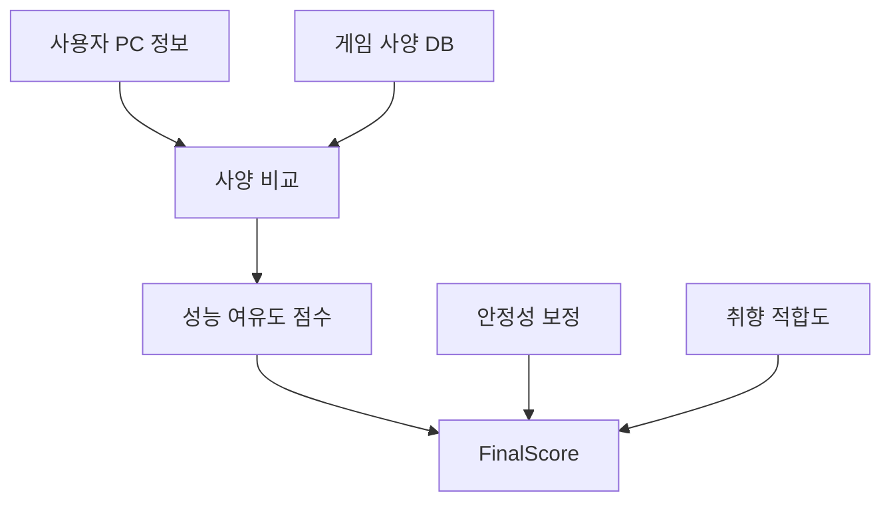
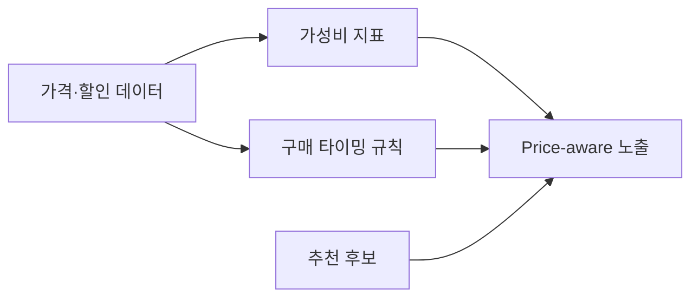
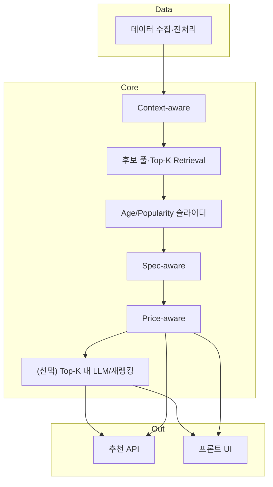
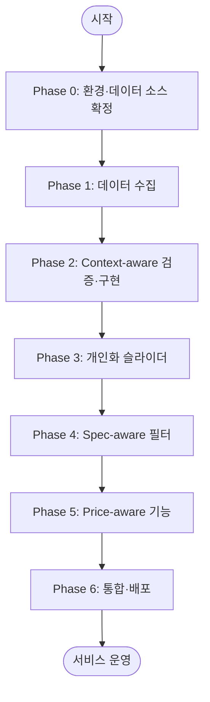

# 게임 추천 시스템 프로젝트 워크플로우

전략 문서(전략.pdf) 기준 **처음부터 끝까지** 진행 계획과 워크플로우를 정리한 문서입니다.

> **포트폴리오용:** 본 프로젝트는 **ML(추천/검색)·LLM(재랭킹·설명)** 을 단계별로 명확히 쓰는 구조입니다. §2, §2.1, Phase별 "사용 기술"을 보면 아키텍처와 툴 사용이 한눈에 들어옵니다.

---

## workflow.md 파일 위치

**추천: `GAME/docs/workflow.md` (현재 위치)**

| 위치 | 장점 | 단점 |
|------|------|------|
| **GAME/docs/** ✅ | 문서가 한곳에 모임(docs/). README·steam-data-sources·scrapable-fields 등과 함께 관리. 루트가 코드·설정 위주로 유지됨. | 루트에서 바로 안 보임 |
| GAME/ (루트) | 저장소 열면 바로 보임. CI/스크립트에서 경로 단순. | 루트에 md가 늘어나 문서/코드 구분이 흐려짐 |

**정리:** 진행 계획·워크플로우는 “프로젝트 문서”에 가깝기 때문에 **docs/** 에 두는 것을 권장합니다. 루트 README에 `[진행 계획 및 워크플로우](docs/workflow.md)` 링크를 두면 접근성도 확보됩니다.

---

# 1. 전략 요약 (전략.pdf 기준)

## 0) 스팀의 내부 추천 시스템 (참고)

- **데이터:** 사용자 플레이 데이터(플레이 시간, 여부, 최근 플레이), 사용자 행동 로그(클릭, 스킵, 큐 선택), 구매·환불, 취향 패턴, **출시일**(유일한 외부 데이터), 인기도 신호, 세션 컨텍스트.
- **미사용:** 리뷰 점수/텍스트, 태그, 큐레이터 추천, 가격/할인율(추천 판단 기준으로는 사용 안 함).
- **참고용:** 우리는 “탈태그/리뷰” 방향을 유지하되, **출시일**과 **플레이 기반 신호**를 강조.

## 1) Context-aware: 지금 내가 어떤 상태인가

- **목표:** “요즘 어떤 게임을 하고 싶은가”를 반영한 즉시적 컨텍스트.
- **입력:** 세션 기반(최근 1~7일 플레이, 세션 길이, 마지막 플레이 경과 시간), 명시적 UI 선택(“가볍게”, “스토리 몰입”, “스트레스 해소”, “싱글만” 등), 환경/시간(평일 vs 주말, 밤/새벽, 남은 플레이 가능 시간).
- **차별화:** Steam은 “이 사람이 좋아하는 게임” 위주 → 우리는 “지금 이 순간 원하는 게임”.

## 2) 사용자 조절 개인화 (슬라이더)

- **출시 시기(Age):** 최신 ~ 10년 전 고전까지.
- **인기도(Popularity):** 메이스트림 vs 니치.

## 3) Spec-aware: 하드웨어 가용성 필터

- **목표:** 재미 × 실행 가능성 동시 최적화.
- **입력:** 사용자 PC(OS, GPU/CPU/RAM), 게임 사양(최소/권장), Steam Deck Verified 등.
- **점수:** 취향 적합도 × 성능 여유도 × 안정성 보정.

## 4) Price-aware: 할인 고려 (추천 판단 주가 아님)

- **목표:** “지금 사면 후회 없을 게임”, 구매 타이밍·가성비 보조.
- **활용:** 현재/과거 할인, 할인 주기, 사용자 구매 성향, ₩1,000당 플레이 시간 등.

---

# 2. 추천 아키텍처 원칙: Retrieval-first (Top-K), LLM은 후보 내에서만

**유저 컨텍스트를 LLM에 바로 넣어 추천을 받는 방식이 아니다.**  
ML 시스템·RAG 시스템처럼 **후보 검색(Retrieval) → Top-K 선택 → (선택) Top-K 내 비교·재랭킹** 구조를 따른다.

| 단계 | 역할 | 비고 |
|------|------|------|
| 1. 컨텍스트 수집 | 사용자 상태·선호·제약 입력 | Phase 2 Context-aware 입력 |
| 2. **후보 풀 생성** | 컨텍스트·메타데이터 기반으로 후보 게임 풀 생성 | 필터·스코어링·임베딩 유사도 등 |
| 3. **Top-K 검색(Retrieval)** | 후보 풀에서 상위 K개 선택 | ML/임베딩/규칙 기반 등, **비교 가능한 구조** |
| 4. (선택) Top-K 내 비교·재랭킹 | K개 안에서만 LLM 또는 다른 모델로 비교·설명·순서 조정 | LLM은 **전체 컨텍스트가 아니라 Top-K 후보**에만 노출 |

- **비교 가능한 구조:** 동일 컨텍스트에 대해 Retrieval/Top-K 결과를 바꿔 가며(모델·파라미터 변경) 성능을 비교할 수 있게 한다.
- **LLM 역할:** “컨텍스트 → LLM → 추천”이 아니라 “컨텍스트 → Retrieval → Top-K → (선택) LLM으로 Top-K 내 재랭킹·설명”으로 한정한다.

### 2.1 포트폴리오용: ML·LLM·툴 사용 요약

아키텍처와 **어디에 ML/LLM이 쓰이는지**를 한 표로 정리한 요약입니다.

| 단계 | 컴포넌트 | ML·LLM·툴 예시 | 비고 |
|------|----------|----------------|------|
| **후보 풀 생성** | 컨텍스트 → 게임 후보 집합 | **ML:** 규칙/휴리스틱, 협업 필터링, 콘텐츠 기반 필터, **임베딩 유사도**(sentence-transformers, game description embedding) | 비교 가능한 구조로 A/B 테스트 용이 |
| **Top-K Retrieval** | 후보 풀에서 상위 K개 선택 | **ML:** 유사도 검색(FAISS, Annoy, ScaNN), 랭킹 모델(Learning-to-Rank), **임베딩** 기반 검색 | 벡터 DB 또는 in-memory 검색 |
| **Top-K 내 재랭킹·설명** | K개 순서 조정 또는 추천 이유 생성 | **LLM:** API(OpenAI, Claude, 로컬 모델)로 Top-K 후보만 입력해 재랭킹·한 줄 설명 생성 | 컨텍스트 전체가 아닌 **후보 메타만** LLM에 전달 |
| **Spec/Price 보정** | 사양·가격 필터·점수 | **ML:** 규칙 기반 점수, (선택) 회귀/분류로 실행 가능성·가성비 예측 | Phase 4, 5 |

- **전체 흐름:** 컨텍스트 수집 → **ML(후보 풀·Top-K)** → (선택) **LLM(Top-K 내 재랭킹·설명)** → 최종 추천.
- **기술 스택 예시:** Python, (임베딩) sentence-transformers / OpenAI Embeddings, (검색) FAISS·Annoy, (LLM) OpenAI/Claude API 또는 로컬 LLM.





---

# 3. 전체 워크플로우 (Phase 개요)

```mermaid
flowchart LR
    subgraph P0["Phase 0"]
        A0[환경·데이터 소스 확정]
    end
    subgraph P1["Phase 1"]
        A1[데이터 수집]
    end
    subgraph P2["Phase 2"]
        A2[1) Context-aware 검증·구현]
    end
    subgraph P3["Phase 3"]
        A3[2) 개인화 슬라이더]
    end
    subgraph P4["Phase 4"]
        A4[3) Spec-aware 필터]
    end
    subgraph P5["Phase 5"]
        A5[4) Price-aware 기능]
    end
    subgraph P6["Phase 6"]
        A6[통합·배포]
    end
    A0 --> A1 --> A2 --> A3 --> A4 --> A5 --> A6
```

---

# 4. Phase별 상세 진행 계획

## Phase 0: 환경·데이터 소스 확정

**목표:** 스토어/API 선택, 수집 대상·형식, 개발 환경 통일.

| 단계 | 내용 |
|------|------|
| 0.1 | **데이터 소스 확정** — 스토어 스크래핑(store.steampowered.com) vs 공식 API. API 키·$5 제한 이슈 있으면 스토어 우선. |
| 0.2 | **수집 대상 필드 목록** — 게임: 앱 ID, 이름, **출시일**, 태그, 사양, 가격·할인 등. 사용자: 최근 플레이, 플레이 시간(가능 시). (참고: `docs/scrapable-fields/columns-all.md`) |
| 0.3 | **저장 형식·스키마** — JSON/CSV/DB, 디렉터리 구조(`data/`, `data/raw/` 등) 팀 합의. |
| 0.4 | **개발 환경** — 언어·프레임워크, 스크래핑/API 클라이언트, Rate limit·윤리 정책. |



---

## Phase 1: 데이터 수집

**목표:** 게임 메타(최소: 앱 ID, 이름, 출시일) 및 가능하면 태그·사양·리뷰 요약·할인 수집. 사용자 플레이 데이터는 소스 확보 시 수집.

| 단계 | 내용 |
|------|------|
| 1.1 | **게임 목록·상세 수집** — 스토어 검색/상세 스크래핑 또는 API GetAppList + 상세 보강. 출시일 필드 확보 필수. |
| 1.2 | **리뷰·태그·사양** — 상세 페이지 또는 store.steampowered.com/appreviews JSON. (전략상 추천 점수는 모델 입력에서 제외 가능, 보조용으로만 사용 여부 팀 결정.) |
| 1.3 | **사용자 플레이 데이터** — 공식 API(GetOwnedGames, GetRecentlyPlayedGames) 또는 steamcommunity 프로필 스크래핑(공개 시). Context-aware에 필요. |
| 1.4 | **검증** — 샘플에 대해 출시일·앱 ID·이름 등 필수 필드 존재 여부 확인. 부족 시 소스·파서 보완. |



---

## Phase 2: 1) Context-aware 검증·구현

**목표:** “지금 내가 어떤 상태인가” 입력 신호를 확보하고, **후보 풀 생성·Top-K Retrieval**까지 이어지는 추천 로직(또는 MVP 휴리스틱)을 설계한다.  
(유저 컨텍스트 → LLM 직접 호출이 아니라, 컨텍스트 기반 **후보 검색·Top-K 선택** 구조를 만든 뒤, 필요 시 Top-K 내에서만 LLM/비교를 사용한다.)

| 단계 | 내용 |
|------|------|
| 2.1 | **입력 신호 매핑** — 전략의 세션 기반(최근 1~7일 플레이, 세션 길이, 마지막 플레이 경과), 명시적 UI(“가볍게”, “스토리 몰입” 등), 환경/시간(평일 vs 주말, 남은 시간)을 “수집 가능 여부”와 연결. |
| 2.2 | **데이터로 채울 수 있는 신호** — 최근 플레이·플레이 시간은 API/프로필에서; 세션 길이는 유추(짧은 세션 vs 몰입 패턴) 또는 UI 입력. |
| 2.3 | **UI로 채울 신호** — “오늘은 가볍게”, “스토리에 몰입”, “멀티 말고 싱글”, “남은 플레이 시간” 등. |
| 2.4 | **추천 로직 설계** — 예: 최근 3일 로그라이크만 짧게 → 짧은 세션 고만족 가중치; RPG 장시간 진행 중 + 평일 밤 → 비슷한 몰입도/사이드 콘텐츠; 장기 미접속 → 재진입 장벽 낮은 게임 우선. **출력은 후보 풀 → Top-K 선택**으로 두어, ML/RAG처럼 비교 가능한 구조로 유지. |
| 2.5 | **구현·테스트** — 휴리스틱 또는 간단한 모델로 **후보 풀 생성 + Top-K Retrieval** 파이프라인 구축. (선택) Top-K 내 LLM/재랭킹은 이후 단계에서 추가. 샘플 유저/시나리오로 검증. |

**Phase 2 사용 기술 (포트폴리오용)**  
- **후보 풀·Top-K:** ML(규칙/협업필터/콘텐츠기반), **임베딩**(sentence-transformers, OpenAI Embeddings), **유사도 검색**(FAISS, Annoy, sklearn).  
- **(선택) 재랭킹·설명:** **LLM** API(OpenAI, Claude) 또는 로컬 LLM — Top-K 후보 메타만 입력.



---

## Phase 3: 2) 사용자 조절 개인화 (슬라이더)

**목표:** Age(출시 시기), Popularity(인기도) 슬라이더로 추천 결과 실시간 조절.

| 단계 | 내용 |
|------|------|
| 3.1 | **출시일 필터** — 수집한 `release_date` 기준으로 “최신만” ~ “10년 전까지” 구간 정의. 슬라이더 값 → 날짜 범위 매핑. |
| 3.2 | **인기도 신호** — “많은 유저가 플레이”(집계) 정의. 예: 리뷰 수·동시 접속·플레이타임 집계 등 수집 가능 지표로 대체. 슬라이더: 메이스트림 ↔ 니치. |
| 3.3 | **UI 연동** — 슬라이더 변경 시 추천 리스트 재계산/재필터링. |
| 3.4 | **통합** — Phase 2 Context-aware 출력을 Age·Popularity로 한 번 더 필터/정렬. |



---

## Phase 4: 3) Spec-aware 필터

**목표:** 사용자 PC 사양·게임 최소/권장 사양을 반영해 “실행 가능성”을 추천 점수에 반영.

| 단계 | 내용 |
|------|------|
| 4.1 | **사양 데이터 확보** — 게임별 최소/권장 사양은 스토어 상세 스크래핑으로 수집. Steam Deck Verified는 스토어/외부 소스. |
| 4.2 | **사용자 PC 정보** — 클라이언트 수집(OS, GPU/CPU/RAM) 또는 사용자 입력. |
| 4.3 | **성능 여유도 점수** — 최소 사양 근접: 감점, 권장 이상: 가산. (규칙 기반 또는 단순 점수화.) |
| 4.4 | **안정성 보정** — 저사양 유저 환불률 등 간접 신호 수집 가능 시 감점. 어렵으면 생략 또는 나중 단계로. |
| 4.5 | **FinalScore 반영** — 취향 적합도 × 성능 여유도 × 안정성 보정. Spec-aware를 선택 옵션으로 둘지 팀 결정. |



---

## Phase 5: 4) Price-aware 기능

**목표:** 추천 판단의 “주 기준”은 아니고, 구매 타이밍·가성비 보조. “지금 사면 후회 없을 게임” 노출.

| 단계 | 내용 |
|------|------|
| 5.1 | **할인·가격 데이터** — 스토어에서 현재 가격·할인율, (가능 시) 과거 최저가·할인 주기 패턴 수집. |
| 5.2 | **가성비 지표** — 할인 후 가격 대비 플레이 타임, ₩1,000당 플레이 시간 등. (플레이 타임은 리뷰/집계 데이터로 근사 가능.) |
| 5.3 | **구매 타이밍 메시지** — “지금이 최저가에 가까움” / “다음 세일까지 기다려도 됨” 규칙 또는 휴리스틱. |
| 5.4 | **추천에 반영** — 취향 × 할인 교차(평소 좋아할 게임 + 현재 대폭 할인) 노출, 또는 별도 “딜” 섹션. |



---

## Phase 6: 통합·배포

**목표:** **Retrieval(Top-K) + (선택) Top-K 내 LLM/비교**를 포함해, Context-aware + Age/Popularity 슬라이더 + (선택) Spec-aware + (선택) Price-aware를 하나의 서비스로 통합.

| 단계 | 내용 |
|------|------|
| 6.1 | **파이프라인 통합** — 데이터 수집 → 전처리 → Context-aware **→ 후보 풀·Top-K Retrieval** → 개인화 슬라이더 → Spec/Price 보정 → **(선택) Top-K 내 LLM/재랭킹** → API/UI 출력. |
| 6.2 | **API·프론트** — 추천 결과 제공 API, 슬라이더·필터 UI. |

**Phase 6 사용 기술 (포트폴리오용)**  
- **통합 파이프라인:** ML(Retrieval/Top-K) + (선택) LLM(재랭킹·설명).  
- **툴:** Python, FastAPI(또는 Flask), (임베딩/검색) sentence-transformers·FAISS·Annoy, (LLM) OpenAI/Claude API.
| 6.3 | **운영** — 데이터 갱신 주기, 로깅, 모니터링. |
| 6.4 | **문서화** — 배포 방법, 환경 변수, 데이터 스키마 정리. |


(LLM/재랭킹 생략 시 C4 → API/UI 로 바로 출력)

---

# 5. 전체 단계 요약 (Mermaid)



---

# 6. 체크리스트 요약

- [ ] **Phase 0:** 스토어/API 확정, 수집 필드·저장 형식, 개발 환경
- [ ] **Phase 1:** 게임 메타(출시일 필수), 리뷰/태그/사양, 사용자 플레이(가능 시)
- [ ] **Phase 2:** Context-aware 입력 신호 매핑, **후보 풀·Top-K Retrieval** 설계·구현(LLM 직접 호출 대신 비교 가능 구조), (선택) Top-K 내 LLM/재랭킹
- [ ] **Phase 3:** Age·Popularity 슬라이더 설계·연동
- [ ] **Phase 4:** 사양 수집·비교, 성능 여유도·안정성 보정, FinalScore 반영
- [ ] **Phase 5:** 할인·가격·가성비, 구매 타이밍, 추천 노출 연동
- [ ] **Phase 6:** 파이프라인 통합, API·UI, 운영·문서화
